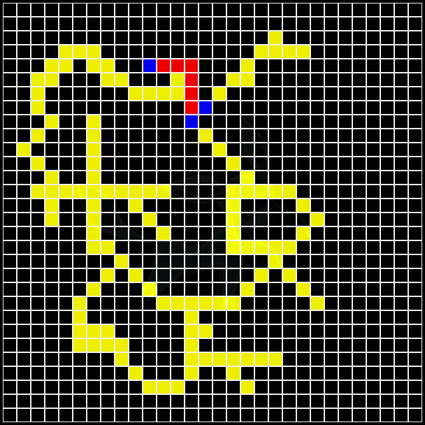

# Cellular Automata
Simple and extensible python cellular automaton. The rules included are: [Conway's Game of Life](https://en.wikipedia.org/wiki/Conway%27s_Game_of_Life), [highlife](https://en.wikipedia.org/wiki/Highlife_(cellular_automaton)), and [wireworld](https://en.wikipedia.org/wiki/Wireworld).

<p align="center">
  
</p>


# Requirements
- [python 3](https://www.python.org/)
- [pygame](https://www.pygame.org/)

    ```
    pip3 install pygame
    ```
# Usage
Clone or download the repository, and launch cellular_automata.py :
```
python cellular_automata.py
```

# Controls
There are basically only two controls:
- p: pause/unpause the simulation
- While in pause, left/right click to cycle through the cell states so that when you unpause, the simulation starts with the new configuration


# Options
It is possible to specify the size of the grid used and which set of rules to use. 
```
optional arguments:
  -h, --help            show this help message and exit
  -c CELLULAR_AUTOMATON, --cellular-automaton CELLULAR_AUTOMATON    Name of the cellular automata to launch
  -s GRID_SIZE, --grid-size GRID_SIZE                               Size of the grid to use
```

### Example
For example, to launch with a grid size of 30 and with the "highlife" rules :
```
python cellular_automata.py -s 30 -c highlife
```
Note: no need to enter ".py" at the end for the rules name.
# Write your own cellular automata
It is very easy to implement your own set of rules for the cellular automata. All you have to do is create a python file that implements 3 things: an enum with all the possible cell states, a dictionnary with the color you want for each cell states and the "next_cell_state(cell, neighbors)" function that takes the cell and a list of its neighbors and returns the state that the cell will take for the next step. There are already a couple of simple examples to base a new cellular automata on.
